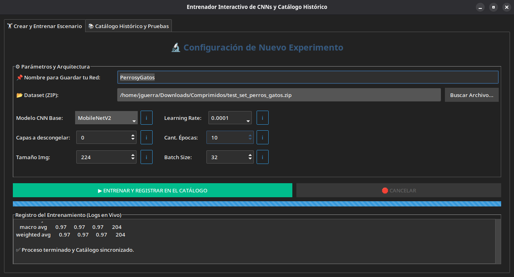
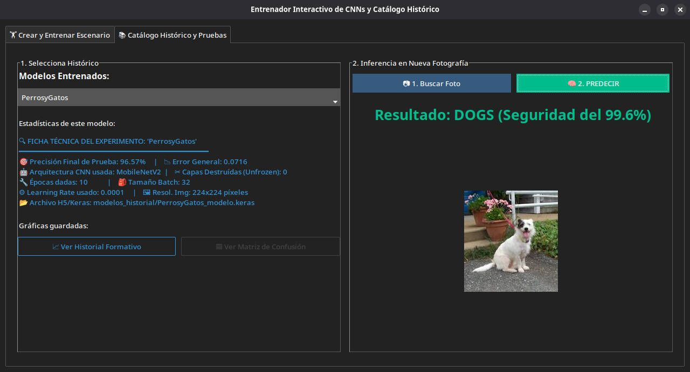

# 🔬 Laboratorio Interactivo de Fine-Tuning con CNNs

<div align="center">


**Una aplicación de escritorio completa para entrenar, experimentar y comparar modelos de Inteligencia Artificial de Visión Computacional sin escribir una línea de código.**

</div>

---

## 📖 Tabla de Contenidos

1. [Introducción y Propósito](#-introducción-y-propósito)
2. [Capturas de Pantalla](#%EF%B8%8F-capturas-de-pantalla)
3. [Conceptos Teóricos](#-conceptos-teóricos)
4. [Arquitecturas CNN Disponibles](#-arquitecturas-cnn-disponibles)
5. [Tecnologías y Librerías](#-tecnologías-y-librerías)
6. [Estructura del Proyecto](#-estructura-del-proyecto)
7. [Arquitectura del Código](#-arquitectura-del-código)
8. [Parámetros de Entrenamiento](#-parámetros-de-entrenamiento)
9. [Instalación y Configuración](#-instalación-y-configuración)
10. [Guía de Uso Paso a Paso](#-guía-de-uso-paso-a-paso)
11. [Sistema de Catálogo Histórico (MLOps)](#-sistema-de-catálogo-histórico-mlops)
12. [Formato del Dataset](#-formato-del-dataset)
13. [Interpretación de Resultados](#-interpretación-de-resultados)
14. [Guía Anti-Overfitting](#-guía-anti-overfitting)
15. [Solución de Problemas](#-solución-de-problemas)

---

## 🧭 Introducción y Propósito

Este proyecto nació como respuesta a una necesidad concreta: **permitir que cualquier persona realice Fine-Tuning de modelos de Deep Learning sin necesidad de dominar la programación**. Investigadores, estudiantes y entusiastas de la IA pueden ahora experimentar con arquitecturas de última generación a través de una interfaz visual intuitiva.

### ¿Qué problema resuelve?

Entrenar una red neuronal convolucional desde cero requiere:
- Millones de imágenes de entrenamiento
- Semanas o meses de cómputo intensivo
- Infraestructura de GPUs de alto rendimiento
- Profundo conocimiento de optimización matemática

**La solución es el Transfer Learning y Fine-Tuning**: aprovechar el conocimiento que gigantes como Google, Microsoft e investigadores del MIT ya destilaron en modelos pre-entrenados sobre ImageNet (14 millones de imágenes, 1000 clases). Esta aplicación envuelve ese proceso complejo en una interfaz visual moderna y accesible.

### Casos de Uso Típicos
- Clasificación de frutas, flores, productos manufacturados
- Detección de defectos en líneas de producción industrial
- Clasificación de razas de animales o especies de plantas
- Identificación de documentos o tipos de imágenes médicas
- Cualquier problema de **clasificación de imágenes multi-clase**

---

## 🖥️ Capturas de Pantalla

### Pestaña 1: Crear y Entrenar Escenario
La interfaz de entrenamiento permite configurar todos los hiperparámetros visualmente. Cada parámetro tiene un botón `ℹ️` que explica su función y cómo afecta al entrenamiento. La barra de progreso y la consola en tiempo real muestran el avance de cada época, y los botones de acción permiten iniciar o cancelar el proceso de forma segura.



### Pestaña 2: Catálogo Histórico y Pruebas
Panel dividido 50/50: a la izquierda, la ficha técnica completa del experimento seleccionado (precisión, arquitectura, hiperparámetros) junto con botones para visualizar las gráficas guardadas de ese modelo. A la derecha, el módulo de inferencia para probar el modelo con cualquier imagen propia y ver el resultado de predicción con su porcentaje de confianza.



---

## 🧠 Conceptos Teóricos

### 1. Redes Neuronales Convolucionales (CNNs)

Las CNNs son la arquitectura dominante en visión por computadora. Funcionan aplicando operaciones de **convolución** sobre la imagen de entrada, lo que les permite detectar patrones jerárquicos:

```
Imagen → [Filtros de Bordes] → [Texturas] → [Patrones] → [Conceptos] → Clasificación
         Capas tempranas      Capas medias               Capas profundas
```

A diferencia de las redes densas tradicionales (que tratan cada píxel como independiente), las CNN respetan la **estructura espacial** de la imagen; un filtro entrenado para detectar una curva funcionará sin importar en qué parte de la imagen se encuentre esa curva.

**Componentes clave:**
- **Capa Convolucional (`Conv2D`):** Aplica filtros aprendibles que detectan características locales
- **Función de Activación (`ReLU`):** Introduce no-linealidad, permitiendo aprender patrones complejos
- **Pooling (`MaxPooling`):** Reduce dimensionalidad preservando las características más importantes
- **Batch Normalization:** Estabiliza el entrenamiento normalizando las activaciones intermedias
- **Dropout:** Técnica de regularización que apaga neuronas aleatoriamente para prevenir sobreajuste
- **GlobalAveragePooling2D:** Colapsa el mapa de características espacial en un vector 1D
- **Capa Densa (`Dense`):** Clasificador final que mapea las características a las clases objetivo

### 2. Transfer Learning (Aprendizaje por Transferencia)

El Transfer Learning es una técnica que permite **reutilizar conocimiento adquirido en una tarea para resolver otra diferente pero relacionada**.

**Analogía humana:** Un médico especializado en cardiología puede aprender radiología más rápido que alguien sin formación médica previa, porque ya comprende anatomía, fisiología y patrones de imagen médica.

**En términos de redes neuronales:**

```
Modelo Pre-entrenado en ImageNet
         │
         ▼
┌─────────────────────┐
│   Base Convolucional │  ← Congela estas capas (conocimiento general)
│   (Detecta bordes,   │
│    texturas, formas) │
└─────────────────────┘
         │
         ▼
┌─────────────────────┐
│    Cabeza Densa      │  ← Entrena solo estas (adaptación a tu tarea)
│    (GlobalAvgPool    │
│     Dense 256        │
│     Softmax N clases)│
└─────────────────────┘
```

Esta aplicación implementa esta arquitectura automáticamente. El resultado es que con solo unas centenas o miles de imágenes propias puedes obtener modelos con alta precisión en cuestión de minutos.

### 3. Fine-Tuning (Ajuste Fino)

El Fine-Tuning va un paso más allá del Transfer Learning básico. Después de entrenar la cabeza clasificadora, se **descongelan selectivamente las últimas capas** del modelo base para que también se adapten a tu dominio específico.

**¿Por qué solo las últimas capas?**

Las capas tempranas de una CNN aprenden características muy genéricas y universales (detectores de bordes, detectores de color). Las capas profundas, en cambio, aprenden características más específicas del dominio de entrenamiento original. Al descongelar solo las últimas capas, permitimos que el modelo ajuste esas características de alto nivel a tu dataset particular.

```
Fine-Tuning con 10 capas descongeladas:

Capa 1  [CONGELADA]  → Detecta bordes horizontales/verticales
Capa 2  [CONGELADA]  → Detecta texturas simples
Capa 3  [CONGELADA]  → Detecta esquinas y formas básicas
...
Capa N-10 [DESCONF] → Se adapta a texturas de frutas
Capa N-5  [DESCONF] → Aprende formas específicas de manzanas/peras
Capa N    [DESCONF] → Especializa representaciones finales
Cabeza    [ENTRENA]  → Clasifica entre tus clases concretas
```

**Regla de oro:** Usa **Learning Rate muy bajo** (0.0001 o menor) al hacer Fine-Tuning para no destruir los pesos pre-entrenados con actualizaciones agresivas.

### 4. Data Augmentation (Aumento de Datos)

Cuando el dataset es limitado (menos de 10,000 imágenes por clase), el modelo puede llegar a *memorizar* las imágenes en lugar de aprender patrones generalizables. El Data Augmentation crea variaciones artificiales en tiempo real durante el entrenamiento:

| Transformación | Propósito |
|---|---|
| `rotation_range=20°` | El modelo no asume que las frutas siempre están derechas |
| `width_shift_range=0.2` | Tolerancia a objetos no centrados horizontalmente |
| `height_shift_range=0.2` | Tolerancia a objetos no centrados verticalmente |
| `horizontal_flip=True` | Una manzana sigue siendo manzana vista de espejo |
| `fill_mode='nearest'` | Rellena píxeles vacíos tras la transformación |

> **Importante:** El Data Augmentation se aplica **únicamente al conjunto de entrenamiento**. Los conjuntos de validación y test solo reciben el reescalado estándar (1/255) para evaluar el rendimiento real sin distorsiones artificiales.

### 5. Overfitting (Sobreajuste) y Cómo Combatirlo

El Overfitting es el problema más común en Deep Learning:

```
Señal de Overfitting:

Pérdida de Entrenamiento  ↓  (bajando continuamente)  ← El modelo "memoriza"
Pérdida de Validación     ↑  (subiendo de golpe)       ← Pero no generaliza

Precisión de Entrenamiento ↑ (llegando a 99%)
Precisión de Validación    ↓ (colapsando)
```

**Estrategias implementadas en esta app:**

1. **ModelCheckpoint inteligente:** Solo guarda el modelo cuando `val_accuracy` mejora. Si la época 7 fue la mejor y las épocas 8-15 mostraron degradación, el archivo guardado sigue siendo el de la época 7.
2. **Dropout(0.5):** Apaga el 50% de neuronas aleatoriamente en cada paso de entrenamiento, forzando al modelo a aprender representaciones redundantes y robustas.
3. **Learning Rate bajo:** Evita actualizaciones de pesos demasiado agresivas que destruirían el conocimiento pre-entrenado.
4. **Data Augmentation:** Extiende artificialmente el dataset, reduciendo la probabilidad de memorización.

---

## 🏗️ Arquitecturas CNN Disponibles

| Modelo | Año | Parámetros | Fortaleza | Resolución Óptima |
|--------|-----|-----------|-----------|-------------------|
| **MobileNetV2** | 2018 | ~3.4M | Ultraligero, ideal para recursos limitados | 224×224 |
| **DenseNet121** | 2017 | ~8M | Conexiones densas, excelente gradiente | 224×224 |
| **ResNet50** | 2015 | ~25M | Residual connections, muy estable | 224×224 |
| **VGG16** | 2014 | ~138M | Sencillo y confiable, clásico de referencia | 224×224 |
| **InceptionV3** | 2016 | ~23M | Multiscala, detecta objetos a diferentes tamaños | 299×299 |
| **EfficientNetV2L** | 2021 | ~480M | Estado del arte en precisión/eficiencia | 480×480 |

### Recomendaciones de Selección

- **Dataset pequeño (<1000 imágenes/clase) + CPU:** MobileNetV2 o DenseNet121
- **Dataset mediano (1000-5000 imágenes/clase):** ResNet50 o InceptionV3
- **Dataset grande (>5000 imágenes/clase) + GPU:** EfficientNetV2L
- **Primera experimentación / prueba rápida:** MobileNetV2 con 0 capas descongeladas

> ⚠️ **EfficientNetV2L** requiere resoluciones de imagen altas y consume considerablemente más memoria RAM/VRAM. Solo recomendado si dispones de GPU dedicada.

---

## 🛠️ Tecnologías y Librerías

### Núcleo de Machine Learning

| Librería | Versión | Función |
|----------|---------|---------|
| `tensorflow` | ≥2.13 | Motor de backpropagation, gestión de tensores y GPUs |
| `keras` | (incluido en TF) | API de alto nivel para definir y entrenar modelos |
| `numpy` | ≥1.24 | Álgebra lineal vectorizada para inferencia y métricas |
| `scikit-learn` | ≥1.3 | Cálculo de métricas: F1-Score, Recall, Matriz de Confusión |

### Interfaz Gráfica

| Librería | Función |
|----------|---------|
| `ttkbootstrap` | Tema "darkly" y widgets modernos sobre tkinter |
| `tkinter` | Backend nativo de GUI (incluido en Python) |
| `Pillow` | Carga, redimensionado y visualización de imágenes en la UI |

### Visualización Científica

| Librería | Función |
|----------|---------|
| `matplotlib` | Gráficas de curvas de pérdida y precisión por época |
| `seaborn` | Mapa de calor de la Matriz de Confusión |

### Utilidades del Sistema

| Módulo | Función |
|--------|---------|
| `zipfile` | Extracción del dataset comprimido |
| `shutil` | Copia y eliminación de directorios temporales |
| `threading` | Ejecución del entrenamiento en hilo secundario |
| `json` | Persistencia del catálogo histórico de experimentos |
| `random` | División aleatoria reproducible del dataset |
| `os` | Gestión de rutas y directorios del sistema de archivos |

---

## 📁 Estructura del Proyecto

```
Interactive-Fine-Tuning-Laboratory-with-CNNs/
│
├── fine_tuning_app.py          # Aplicación principal (código fuente completo)
├── requirements.txt            # Dependencias del entorno virtual
├── README.md                   # Este archivo
├── .gitignore                  # Exclusiones de control de versiones
│
├── model_registry.json         # Base de datos JSON de experimentos registrados
│                               # (generado automáticamente al entrenar)
│
├── modelos_historial/          # Carpeta de archivos .keras por experimento
│   ├── Experimento_A_modelo.keras
│   ├── Experimento_B_modelo.keras
│   └── ...
│
├── graficas_historial/         # Gráficas PNG organizadas por experimento
│   ├── Experimento_A/
│   │   ├── historial_formativo.png
│   │   └── matriz_confusion.png
│   ├── Experimento_B/
│   │   ├── historial_formativo.png
│   │   └── matriz_confusion.png
│   └── ...
│
├── dataset_temp/               # Directorio temporal de extracción del ZIP
│   └── (eliminado automáticamente al finalizar el entrenamiento)
│
└── dataset_split/              # División automática del dataset
    ├── train/                  # 70% de los datos (con augmentation)
    │   ├── clase_1/
    │   └── clase_2/
    ├── val/                    # 20% de los datos (solo reescalado)
    │   ├── clase_1/
    │   └── clase_2/
    └── test/                   # 10% reservado (evaluación final pura)
        ├── clase_1/
        └── clase_2/
```

---

## ⚙️ Arquitectura del Código

### Diagrama de Componentes

```
┌───────────────────────────────────────────────────────────────┐
│                      fine_tuning_app.py                       │
│                                                               │
│  ┌─────────────────────┐    ┌──────────────────────────────┐  │
│  │  KerasUIDispatcher  │    │       FineTuningApp          │  │
│  │  (Keras Callback)   │◄───│  (Clase principal de la GUI) │  │
│  │                     │    │                              │  │
│  │ on_batch_end()      │    │  build_ui()                  │  │
│  │   → verifica flag   │    │  build_train_tab()           │  │
│  │     de cancelación  │    │  build_test_tab()            │  │
│  │                     │    │                              │  │
│  │ on_epoch_end()      │    │  start_training()            │  │
│  │   → envía métricas  │    │  cancel_training()           │  │
│  │     a la UI via     │    │  training_process()   ──────────┼──►  Thread Daemon
│  │     root.after()    │    │  predict_image()             │  │
│  └─────────────────────┘    │  show_results()              │  │
│                             │  show_plot_window()          │  │
│                             │  on_model_selected()         │  │
│                             └──────────────────────────────┘  │
│                                                               │
│  ┌────────────────┐  ┌─────────────────┐                      │
│  │  load_registry │  │  save_registry  │ ← Funciones globales │
│  └────────────────┘  └─────────────────┘   de persistencia    │
└───────────────────────────────────────────────────────────────┘
```

### Flujo de Ejecución del Entrenamiento

```
Usuario presiona "INICIAR ENTRENAMIENTO"
            │
            ▼
    Validaciones de entrada
    (nombre, ZIP existente)
            │
            ▼
    Thread daemon lanzado
    (evita congelación de UI)
            │
            ▼
    Extracción del ZIP
    Detección automática de clases
            │
            ▼
    División aleatoria 70/20/10
    Copia a carpetas train/val/test
            │
            ▼
    Creación de ImageDataGenerators
    (con augmentation en train)
            │
            ▼
    Descarga del modelo base de ImageNet
    Congelación/descongelación de capas
    Adición de cabeza clasificadora
    Compilación con Adam optimizer
            │
            ▼
    model.fit() con callbacks:
    ├── KerasUIDispatcher → actualiza UI
    └── ModelCheckpoint  → guarda mejor val_acc
            │
            ├── [Si cancelado] → limpia temp, retorna
            │
            ▼
    Evaluación en Test Set
    Registro en model_registry.json
    Generación y guardado de gráficas
            │
            ▼
    Actualización del Combo en pestaña 2
    UI desbloqueada
```

### Sistema de Cancelación Segura

La cancelación no usa `Thread.kill()` (que corrompería el estado de TensorFlow). En su lugar:

```python
# Flag compartido entre hilo de UI y hilo de entrenamiento
self.stop_training_flag = True

# En KerasUIDispatcher.on_batch_end():
if self.app.stop_training_flag:
    self.model.stop_training = True  # API oficial de Keras para detención limpia
```

Esto espera a que el micro-lote actual termine, libera la GPU correctamente y retorna sin escribir métricas corruptas al catálogo.

---

## 🎛️ Parámetros de Entrenamiento

### Nombre del Experimento
Identificador único alfanumérico para este entrenamiento. Se usa como clave en `model_registry.json` y como nombre de carpeta para las gráficas. Ejemplos: `MobileNetV2_LR0001_10epochs`, `ResNet50_Frutas_v2`.

### Modelo CNN Base
Ver tabla comparativa en la sección [Arquitecturas CNN Disponibles](#arquitecturas-cnn-disponibles).

### Learning Rate (Tasa de Aprendizaje)

| Valor | Cuándo usarlo |
|-------|---------------|
| `0.01` | Solo entrenamiento desde cero (nunca en Fine-Tuning) |
| `0.001` | Transfer Learning sin descongelar capas base |
| `0.0001` | ✅ **Recomendado** para Fine-Tuning con pocas capas |
| `0.00001` | Fine-Tuning agresivo con muchas capas descongeladas |

### Capas a Descongelar

| Valor | Efecto |
|-------|--------|
| `0` | Solo entrena la cabeza. Máxima estabilidad, mínimo riesgo de overfitting |
| `5-10` | Ajuste fino suave. Recomendado como punto de partida |
| `20-30` | Adaptación más profunda. Requiere dataset mayor (>3000 imágenes/clase) |
| `50+` | Muy agresivo. Solo con datasets grandes y Learning Rate muy bajo |

### Épocas
Número de veces que el modelo recorre todo el dataset de entrenamiento. El `ModelCheckpoint` garantiza que siempre se guarda la mejor época (por `val_accuracy`), así que aumentar épocas no destroza el modelo guardado, pero sí aumenta el tiempo de entrenamiento.

### Tamaño de Imagen

| Modelo | Resolución Recomendada | Resolución Mínima |
|--------|------------------------|-------------------|
| MobileNetV2, ResNet50, VGG16, DenseNet121 | 224 | 128 |
| InceptionV3 | 299 | 224 |
| EfficientNetV2L | 480 | 299 |

### Batch Size

| Valor | Efecto en entrenamiento |
|-------|------------------------|
| `8-16` | Gradiente ruidoso pero puede escapar mínimos locales. Lento |
| `32` | ✅ **Balance ideal** para la mayoría de casos |
| `64-128` | Entrenamiento más suave y rápido, requiere más RAM |
| `256+` | Solo con GPU dedicada de alta memoria VRAM |

---

## 🛠️ Instalación y Configuración

### Requisitos del Sistema

- **Python:** 3.10, 3.11 o 3.12 (TensorFlow no soporta 3.13+ aún)
- **RAM:** Mínimo 8 GB (recomendado 16 GB)
- **Almacenamiento:** ~5 GB para modelos y dependencias
- **GPU (opcional):** NVIDIA con CUDA 11.x+ para aceleración

### Paso 1: Clonar el Repositorio

```bash
git clone https://github.com/iJoseG/Interactive-Fine-Tuning-Laboratory-with-CNNs
cd Interactive-Fine-Tuning-Laboratory-with-CNNs
```

### Paso 2: Crear el Entorno Virtual

```bash
# Verificar versión de Python (debe ser 3.12 o inferior)
python3 --version

# Crear entorno virtual aislado
python3.12 -m venv venv_tf

# Activar el entorno
source venv_tf/bin/activate      # Linux / macOS
# venv_tf\Scripts\activate       # Windows
```

> Deberías ver `(venv_tf)` al inicio de tu prompt de terminal. Esto confirma que el entorno está activo y las instalaciones no afectarán al Python del sistema.

### Paso 3: Instalar Dependencias

```bash
pip install --upgrade pip
pip install -r requirements.txt
```

El archivo `requirements.txt` incluye:
```
tensorflow
numpy
matplotlib
seaborn
scikit-learn
ttkbootstrap
pillow
```

La descarga de TensorFlow puede tardar varios minutos dependiendo de tu conexión.

### Paso 4: Verificar la Instalación

```bash
python -c "import tensorflow as tf; print('TF OK:', tf.__version__)"
python -c "import ttkbootstrap; print('ttkbootstrap OK')"
```

---

## 📋 Guía de Uso Paso a Paso

### Ejecutar la Aplicación

```bash
# Asegúrate de estar en el directorio del proyecto con el venv activo
source venv_tf/bin/activate
python fine_tuning_app.py
```

### Pestaña 1: Crear y Entrenar Escenario

1. **Bautizar el experimento:** Escribe un nombre descriptivo en el campo "Nombre para Guardar tu Red". Usa nombres significativos como `MobileNetV2_10epocas_frutas` para facilitar la comparación posterior.

2. **Cargar el Dataset:** Haz clic en "Buscar Archivo..." y selecciona tu archivo `.zip` con el dataset. Ver [Formato del Dataset](#formato-del-dataset) para la estructura esperada.

3. **Configurar hiperparámetros:** Ajusta los parámetros según tu caso. Si eres nuevo, usa los valores por defecto como punto de partida.

4. **Consultar la documentación:**  Cada parámetro tiene un botón `ℹ️`. Úsalo para entender qué hace cada ajuste antes de modificarlo.

5. **Iniciar entrenamiento:** Presiona "▶️ ENTRENAR Y REGISTRAR EN EL CATÁLOGO". La consola mostrará el progreso en tiempo real.

6. **Cancelar si es necesario:** El botón rojo "🛑 CANCELAR" interrumpe el entrenamiento de forma segura al finalizar el micro-lote actual.

7. **Revisar resultados:** Al terminar, se abrirán automáticamente las ventanas de matplotlib con las curvas de entrenamiento y la matriz de confusión.

### Pestaña 2: Catálogo Histórico y Pruebas

**Panel Izquierdo — Ficha Técnica del Modelo:**
1. Selecciona cualquier experimento del dropdown "Modelos Entrenados"
2. Lee la ficha técnica: precisión obtenida, arquitectura usada, hiperparámetros configurados
3. Usa "📈 Ver Historial Formativo" para abrir las curvas de pérdida/accuracy
4. Usa "🟦 Ver Matriz de Confusión" para ver los errores de clasificación

**Panel Derecho — Inferencia:**
1. Asegúrate de tener el modelo correcto seleccionado en el dropdown
2. Haz clic en "📷 1. Buscar Foto" y selecciona una imagen de tu disco
3. La app mostrará una previsualización centrada de la imagen
4. Haz clic en "🧠 2. PREDECIR" para obtener la clasificación
5. El resultado aparece en texto grande con el nombre de la clase y el porcentaje de confianza

---

## 📊 Sistema de Catálogo Histórico (MLOps)

Cada experimento completado queda registrado permanentemente en `model_registry.json`:

```json
{
    "MobileNetV2_Frutas_v1": {
        "file_path": "modelos_historial/MobileNetV2_Frutas_v1_modelo.keras",
        "base_cnn": "MobileNetV2",
        "unfreeze": 4,
        "learning_rate": 0.0001,
        "img_size": 224,
        "epochs": 10,
        "batch_size": 32,
        "test_accuracy": 0.9512,
        "test_loss": 0.1823,
        "classes": ["apple", "coconut", "orange", "pear", "pineapple", "strawberry", "watermelon"]
    },
    "ResNet50_Frutas_v1": {
        ...
    }
}
```

Este registro permite:
- **Comparar** la precisión de diferentes arquitecturas sobre el mismo dataset
- **Reproducir** exactamente las condiciones de cualquier experimento
- **Cargar** cualquier modelo para inferencia sin recordar su configuración
- **Auditar** el historial de experimentos para reportes o publicaciones

---

## 🗂️ Formato del Dataset

El dataset debe ser un archivo `.zip` con imágenes organizadas en **subcarpetas por clase**:

```
mi_dataset.zip
└── (carpeta raíz opcional)
    ├── manzana/
    │   ├── img001.jpg
    │   ├── img002.jpg
    │   └── ...
    ├── pera/
    │   ├── img001.jpg
    │   └── ...
    └── naranja/
        ├── img001.jpg
        └── ...
```

### Requisitos del Dataset

| Requisito | Detalle |
|-----------|---------|
| **Clases mínimas** | 2 (no tiene sentido clasificar una sola categoría) |
| **Formatos soportados** | `.jpg`, `.jpeg`, `.png`, `.bmp` |
| **Imágenes por clase** | Mínimo 50, recomendado 500+ |
| **Balance de clases** | Idealmente similar número entre clases |
| **Resolución mínima** | Mayor al tamaño de imagen configurado |

> **Nota:** Los nombres de las carpetas son los nombres de las clases. Usa nombres simples sin espacios ni caracteres especiales: `apple`, `strawberry`, `watermelon`.

### División Automática

La app realiza una división aleatoria automática del dataset:

```
Dataset completo
       │
   ┌───┴───────────────┐
   │                   │
  70%                 30%
 TRAIN               ┌──┴──┐
(con augmentation)   │     │
                    20%   10%
                    VAL   TEST
                  (validación  (evaluación
                  por época)    final pura)
```

---

## 📈 Interpretación de Resultados

### Curvas de Entrenamiento

**Escenario ideal — Sin Overfitting:**
```
Loss:  Train ↓  Val ↓  (ambas bajan juntas)
Acc:   Train ↑  Val ↑  (ambas suben juntas)
```

**Overfitting claro:**
```
Loss:  Train ↓↓↓  Val ↑↑↑  (se separan en tijera)
Acc:   Train ↑↑↑  Val ↓↓   (la validación colapsa)
```

**Underfitting:**
```
Loss:  Train sigue alta después de muchas épocas
Acc:   Train < 60% incluso tras 20 épocas
```

### Matriz de Confusión

La diagonal principal (de arriba-izquierda a abajo-derecha) representa **clasificaciones correctas**. Los valores fuera de la diagonal son **errores**:

```
                 Predicción
              Apple  Pear  Orange
Real Apple  [  95     3      2  ]  ← 95 manzanas identificadas correctamente
Real Pear   [   5    90      5  ]  ← 5 peras confundidas con manzanas
Real Orange [   1     2     97  ]  ← 97 naranjas correctas
```

### Reporte de Clasificación

```
              precision  recall  f1-score  support
       apple       0.94    0.95      0.94      100
        pear       0.94    0.90      0.92      100
      orange       0.91    0.97      0.94      100
    accuracy                         0.94      300
```

- **Precision:** De todas las veces que el modelo dijo "esto es una manzana", ¿qué porcentaje realmente lo era?
- **Recall:** De todas las manzanas del test set, ¿qué porcentaje encontró el modelo?
- **F1-Score:** Media armónica entre Precision y Recall. La métrica más equilibrada.
- **Support:** Número de imágenes de esa clase en el test set.

---

## 🛡️ Guía Anti-Overfitting

Si observas que la `val_loss` empieza a subir mientras la `train_loss` sigue bajando, aplica estas correcciones **en orden de impacto**:

### 1. Bajar el Learning Rate
```
0.001 → 0.0001 → 0.00001
```
El ajuste más impactante. Un LR alto hace que el modelo sobre-escriba los pesos útiles.

### 2. Reducir las Capas Descongeladas
```
20 capas → 10 capas → 5 capas → 0 capas
```
Menos libertad para modificar el modelo base = menos riesgo de sobreajuste.

### 3. Reducir las Épocas
El ModelCheckpoint ya guarda el mejor modelo. Pero más épocas implican más tiempo perdido.

### 4. Aumentar el Dataset
Consigue más imágenes de las clases con peor rendimiento (las que tienen recall bajo en el reporte).

### 5. Reducir el Batch Size
Batch sizes más pequeños producen gradientes más ruidosos, que actúan como regularización implícita.

---

## 🔧 Solución de Problemas

### Error: `TclError: unknown option "-padding"`

**Causa:** Incompatibilidad entre la versión de `ttkbootstrap` y `tkinter` del sistema.
**Solución:** Asegúrate de no pasar `padding=` directamente al constructor de `ttk.LabelFrame`. Usa `ipadx`/`ipady` en `.pack()`.

### Error: `ValueError: Input 0 of layer is incompatible`

**Causa:** El tamaño de imagen configurado no es compatible con la arquitectura seleccionada.
**Solución:**
- InceptionV3 requiere mínimo 75×75, recomendado 299×299
- EfficientNetV2L requiere mínimo 32×32, recomendado 480×480

### Error: `OOM (Out Of Memory)` de GPU

**Causa:** El Batch Size es demasiado grande para la VRAM disponible.
**Solución:** Reduce el Batch Size a 16 o incluso 8.

### La validación no mejora después de muchas épocas

**Causa:** Posible underfitting por Learning Rate demasiado bajo, o el modelo necesita más capas descongeladas.
**Solución:** Prueba subir el LR de 0.00001 a 0.0001, o descongelar 5-10 capas.

### `WARNING: GPU will not be used`

**Causa:** No están instalados los drivers CUDA o cuDNN de NVIDIA.
**Solución:** El entrenamiento funciona en CPU aunque es más lento. Para habilitar GPU, instala CUDA Toolkit y cuDNN compatibles con tu versión de TensorFlow.

### El modelo predice siempre la misma clase

**Causa:** Overfitting severo durante el entrenamiento. El modelo colapsa a predecir la clase más frecuente.
**Solución:** Reinicia con LR más bajo (0.00001), 0 capas descongeladas y solo 5-10 épocas iniciales.

---

## 📄 Licencia

Este proyecto está distribuido bajo la licencia MIT. Puedes usarlo, modificarlo y distribuirlo libremente citando la fuente original.

---

<div align="center">
Desarrollado como herramienta educativa y de investigación en Inteligencia Artificial y Visión Computacional.
</div>
